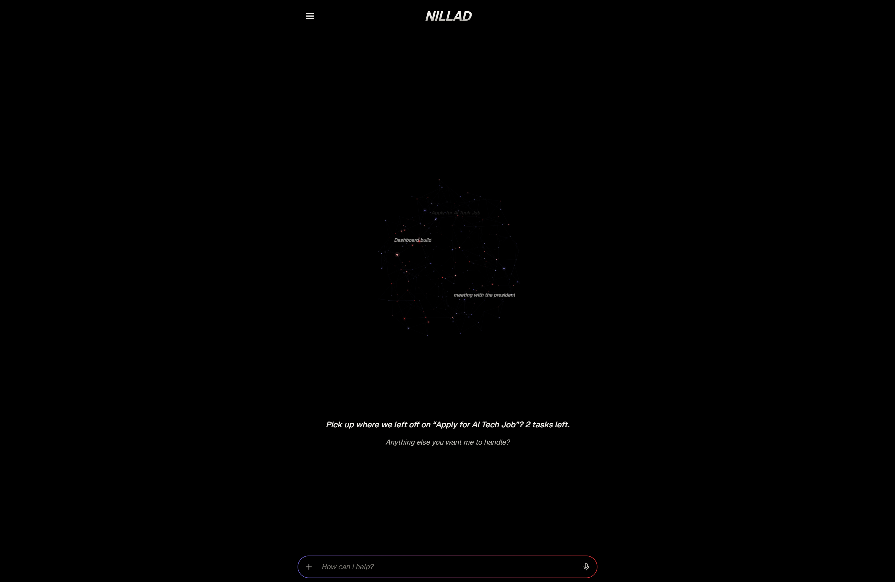

# Nillad: a local-first personal AI assistant

**Built by Dallin Theriault.** A personal project: a self-hosted AI assistant that runs entirely on my own hardware, with persistent memory, SMS, reminders, and a calendar, all reachable from my phone.

> **How this was built, read this first.** I am not a software engineer and I did not hand-write the code in this project. I architected and directed it. I made the technical decisions, scoped the work, communicated requirements to AI coding tools, debugged against real system logs, and drove the project to a working, verified state. The code itself was written by AI (Claude). I’m including this note up front because it’s the honest account of how the project was made, and because directing AI tools to a shipped, debugged system is the actual skill this project demonstrates.

-----

## Screenshots

<table>
  <tr>
    <td width="50%"> <b>Home</b> — the assistant surfaces what you were working on and what’s next.</td>
    <td width="50%"> <b>Conversational reminders</b> — a natural-language request becomes a scheduled reminder via tool-calling.</td>
  </tr>
  <tr>
    <td width="50%"> <b>Calendar</b> — events and reminders in one view.</td>
    <td width="50%"></td>
  </tr>
</table>

-----

## Why I built it

Three honest reasons.

1. **I wanted a JARVIS.** Like a lot of people, the Iron Man assistant is the thing I always wanted, something that just knows my context and does things for me.
1. **I was tired of having to remember everything**, jobs, contacts, follow-ups, reminders. I wanted one place that held it and acted on it.
1. **I wanted to cut my AI costs.** Cloud AI and per-execution automation billing add up. Running the model and the automation layer locally drives the marginal cost toward zero.

## What it is

Nillad is a **local-first** personal assistant. Everything that can run locally, runs locally. The language model, the database, and the automation engine all live on my own machine (a Windows PC with an RTX 5080). **My data never leaves my hardware.** The only things that touch the internet are the parts that have to: sending and receiving SMS, and web search.

It’s not a SaaS product and it’s not for sale. It’s a personal tool I use, reachable from my phone through a private network.

## What it actually does

Only real, working features are listed here.

- **Conversational assistant with tool-calling.** I chat with it (typed or dictated), and it calls tools to actually *do* things, not just talk. It runs a local model and executes the tools itself.
- **Two-way SMS.** It can send texts to my contacts when I tell it to (“text Tanner that the quote’s ready”), and incoming texts are logged and pushed to my phone as notifications. It does **not** auto-reply to anyone. I read and direct every response.
- **Reminders.** Set in natural language (“remind me to call the plumber in 2 hours”), delivered on time by SMS and push notification.
- **Calendar.** Real events plus reminders, viewable and editable.
- **Persistent memory.** Conversations, contacts, activities, reminders, and messages persist in a local database, so it remembers context across sessions and can answer “what was I working on?”
- **Remote access.** I use all of this from my phone, anywhere, over a private network tunnel back to my machine.

## How it’s built

- **Local language model** served on my own GPU (via Ollama), the assistant’s “brain,” running at zero marginal cost.
- **A mobile interface** (Next.js), the app I actually touch. It talks directly to the local model and runs the tool-execution loop itself.
- **One local database** (SQLite), the single source of truth for jobs, contacts, reminders, messages, and activities. All local, no cloud dependency.
- **A self-hosted automation engine** (n8n, in Docker), handles scheduled jobs (firing reminders) and inbound SMS webhooks. Moving this off the cloud is what actually started cutting costs.
- **SMS** via Twilio. **Push notifications** via a self-hosted ntfy server.
- **Private remote access** via Tailscale, exposes only what’s needed, nothing public beyond the inbound SMS webhook.

The whole system is containerized and comes up with a single launcher.

-----

## Engineering deep-dives

Two problems from this project that show what “debugging it to a working state” actually meant. I include these because finding and fixing them, by reading real logs and reasoning about the system rather than guessing, is the part I’m proud of.

### 1. Inbound texts silently failing: a signature bug behind a reverse proxy

**Symptom:** Outbound texts worked, but inbound texts to the number never showed up in the app, and no notification fired. Several rounds of checking the app and database, and everything *looked* correct.

**The catch:** I couldn’t physically test inbound, because the number is a Twilio number with no handset. The only way to see the truth was the provider’s own logs. Going to the Twilio console surfaced the real error: **11200, the webhook was returning HTTP 403 Forbidden** on every inbound message. So the texts *were* arriving at Twilio, Twilio *was* calling our webhook, and our automation layer was rejecting them.

**Root cause:** The webhook validated Twilio’s request signature for security. Twilio signs requests with **HMAC-SHA1**, but the validation node, despite being *named* “Compute HMAC-SHA1,” was configured to compute **SHA512**. The signatures never matched, so every legitimate request was rejected with a 403. A node that was labeled one thing and doing another.

**Fix and verification:** Corrected the algorithm to SHA1. Because the signing secret and algorithm live in the workflow, I could **forge a validly-signed request** and verify the entire pipeline end to end without a handset. Webhook now returns 200, the message is stored, the conversation thread populates, and the push notification fires. Confirmed the signing secret exactly matched the account’s auth token, so real inbound traffic would validate too. Crucially, the fix **kept signature validation on**, unsigned requests are still rejected, so the public webhook stayed secured.

**Why it mattered:** The lesson was going to the source of truth (the provider’s logs) instead of inferring from symptoms. The bug was invisible from every layer I could see locally. It only showed up in Twilio’s logs.

### 2. A database journal mode that silently broke across containers

**Symptom:** Reminders fired late or not at all, and inbound messages weren’t being stored, but the chat assistant and outbound messages worked fine. One root cause was hiding behind several different symptoms.

**Root cause:** The local SQLite database was in **WAL (write-ahead logging) journal mode**, and WAL relies on a shared-memory file that **isn’t coherent across Docker bind mounts on Windows**. The database is shared by multiple containers all mounting the same folder. The interface held a long-lived connection that kept working (which masked the problem), but the automation engine opened a *fresh* database connection on every run, and those fresh connections failed. So the scheduled reminder job couldn’t read due reminders, and the inbound handler couldn’t write incoming messages.

**Fix:** Switched the database to a rollback-journal mode that doesn’t depend on the shared-memory file, and documented it as a hard constraint so it can’t get reintroduced. Verified that both containers can now read and write the database concurrently.

**Why it mattered:** This is a systems-level failure. The bug wasn’t in any one piece of code, it was in how a database setting interacted with the container environment. Three unrelated-looking symptoms all traced back to one root cause.

### A design decision worth noting

The assistant **structurally cannot** auto-reply to incoming texts, not because a prompt tells it not to, but because the code path that sends messages can only be triggered by me, in the app. Incoming texts flow through a completely separate path that only logs and notifies. The guardrail is enforced by the architecture, not just by instructions.

-----

## Honest limitations and what’s next

I’d rather be accurate about what this is than oversell it.

- **Voice is not built.** A spoken JARVIS-style interface is the eventual goal, not a current feature.
- **The local model is a small one.** It’s fast and reliable for everyday assistant tasks and tool-calling, which is what it’s for. It is not a frontier reasoning model, and it isn’t meant to be. Hard reasoning is a job for tools outside this system.
- **Cost-cutting is partially realized.** Moving the automation engine off the cloud removed recurring billing. Fully consolidating everything local is ongoing.
- **It’s single-user.** No multi-tenant accounts, by design. It’s a personal tool, secured by running on a private network rather than by a full auth system.

## A note on how I work

I treat AI coding tools the way a technical lead treats a team. I hold the roadmap, scope each task tightly, communicate requirements precisely, guard against scope creep, and verify the output against reality. The code was written by AI. The judgment about *what* to build, *why*, in *what order*, and whether it actually works, and the debugging when it didn’t, was mine.

-----

*Personal project. Not affiliated with any employer. Built and maintained by Dallin Theriault.*
